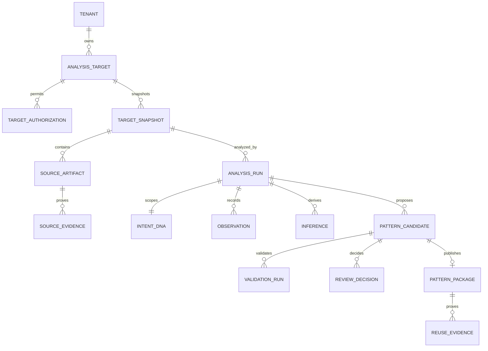

# 02. 전체 도메인 모델

- 명세 ID: APF-DOMAIN-001
- 목표: 출처에서 재사용 증거까지 완전 추적

## Aggregate

### Governance
- Tenant: 자료 소유 경계
- Principal: HUMAN, ARKAON, ETERNIAN, SERVICE
- RoleAssignment: 역할·범위·유효기간
- ApprovalPolicy: 위험등급별 승인 규칙

### Acquisition
- AnalysisTarget: 분석할 시스템
- TargetAuthorization: 소유·위임·라이선스와 허용범위
- SourceArtifact: 파일·문서·스키마·API·화면흐름
- SourceEvidence: 출처 URL/식별자, 라이선스, 해시, 취득시각
- TargetSnapshot: 특정 시점의 불변 원본 묶음

### Intent
- IntentDNA: Why/Who/Value/Outcome/Constraint/Risk/Invariant/Signal
- IntentHypothesis: 추정된 의도와 신뢰도
- IntentDecision: CONFIRMED, REJECTED, NEEDS_EVIDENCE
- AnalysisBudget: 분석시간·토큰·깊이 제한

### Analysis
- AnalysisRun: 하나의 분석 실행
- Observation: 원본에서 직접 확인한 사실
- Inference: 사실에서 추론한 구조
- DomainMap: bounded context와 책임
- RolePermissionMap, DataModelMap, StateMachineMap, APIMap
- AnalysisGap: 누락 또는 확인 필요사항

### Pattern
- PatternCandidate: 추출된 후보
- PatternVersion: 후보의 불변 버전
- ApplicabilityRule: 적용조건
- AntiPattern: 실패·금지조건
- ModuleCandidate: 재사용 기능모듈
- PatternRelation: DUPLICATES, EXTENDS, CONFLICTS, REPLACES, COMPOSES

### Assurance
- ValidationRun: schema/security/license/contamination/semantic 검사
- Finding: ERROR, WARNING, INFO
- Review: 검토 단위
- ReviewDecision: APPROVE, REJECT, HOLD, REQUEST_CHANGES
- Approval: 승인자의 서명성 기록

### Registry
- PatternPackage: 공식 자산
- PackageRelease: immutable semantic version
- Deprecation: 폐기 및 대체 대상
- SearchDocument: 권한 필터된 검색 투영
- ReuseCase: 적용할 신규사업
- ReuseEvidence: 실제 적용 결과와 절감시간

## 핵심 관계

## 소유권

원본과 Snapshot은 Tenant 소유다. 공용 Package는 누리온 Registry 소유이나 파생 가능 권리가 명시된 경우에만 생성된다. Foundry는 어느 운영거래·회원·결제도 소유하지 않는다.

## 식별·동시성

모든 엔티티는 UUIDv7, created_at/updated_at, created_by, tenant_id를 사용한다. 변경 가능한 aggregate는 revision과 optimistic lock을 가진다. 승인·출시·감사 엔티티는 append-only다.
